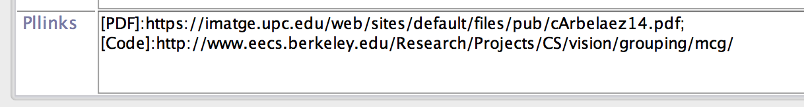

In this post I'll share some of my experiences building my personal academic website. I started with the following requirements:

* I had never built a decent webpage before and I didn't want to spend a lot of time learning.
* I wanted **free hosting without ads**.
* The page should contain a **blog**.
* **Easy-to-mantain publications** page.
* It should look well both in mobiles and computers.
* I wanted the solution to be as **long-lasting** as possible.

I started by searching for "free web hosting" at Google, and so I started by exploring sites like [Weebly](weebly.com). It was free (for my current needs), easy to use, acceptably customizable, and looked good on mobiles. The problem for me were the long-term implications of hosting and editing everything on a *closed* site: what if my expectations from the web change in the future? Would I be able to export all the work put into it if the conditions for the service change?

 
I ended up finding [Github Pages](https://pages.github.com), which allowed me to host my page for free, and edit everything locally through git. Awesome! But then how to create a nice webpage with a blog? (Remember I am a completely newbie at this)... yep, I've seen that I should use [Jekyll](http://jekyllrb.com), but I also want my site to look nice! Thankfully, I came across an awesome template, called [Minimal Mistakes](https://github.com/mmistakes/minimal-mistakes), that was a good starting point. The same author has another theme [So Simple](https://github.com/mmistakes/so-simple-theme), big kudos to [Michael Rose](https://github.com/mmistakes)!

 
The only thing I needed, therefore, was to fork the Minimal Mistakes repository into a new repository in my git, with the name:
	
`username.github.io ` 
I did some small changes, I pushed them to github, and *voilà*! My page was up and running! So far I had fulfilled all constraints but one: having an easy-to-mantain publications page. Let's get to it!

## Easy-to-mantain publications page

I keep all my bibliographic references indexed using [Jabref](http://jabref.sourceforge.net) because:

* It's cross-platform: Linux, Mac, you name it.
* It's open: The database is stored as a Bibtex text file, which is very convenient if you use LaTeX (which you should), you'll never be chained to a proprietary format, and you can store it in a version control system such as SVN or Git (which you also should).
* It's free: The word says it all.

I also keep track of my publications in Jabref, so now the goal is to export them directly from Jabref to the webpage. To do so, I found [Publist](http://www.seas.upenn.edu/~nghiem/publist.html), which is a custom export for Jabref to html. It nicely includes the bibtex citation in the HTML, and it allows you to keep track of the links to code, PDF, project page, etc. directly from Jabref, via a custom field in the publication entry.

 
The first step is to install it, as explained in the [Publist](http://www.seas.upenn.edu/~nghiem/publist.html) page.

 
Now let us imagine we want the publication in our webpage to have a link appearing as `[PDF]` pointing to `http://here_is_my_pdf.com`. The first thing we need to do is tell Jabref to include a custom field named `pllinks`, by going to `Options > Customize entry types`, and adding the optional field `pllinks` to all the types of publications we want, like in the image below. (You have to type "pllinks" in the textbox, it's not in the list.)

 

 
Once the field is active, we can add all links we want in the format:
`[PDF]:http://here_is_my_pdf.com`
If we want to add more links, we separate them by `;` as in the example in the image:

 

 
You now simply export the publications you want by selecting `File > Export selected entries` and select `Publist2html` in the `File format` field. This should give you a piece of html code ready to paste into your website.

 
For the code to work properly, however, we still have to add a piece of CSS code to our website. In the package downloaded from publist there is a `bibtex.css` file containing that code. Simply paste it to the header of your page, and you're done!

